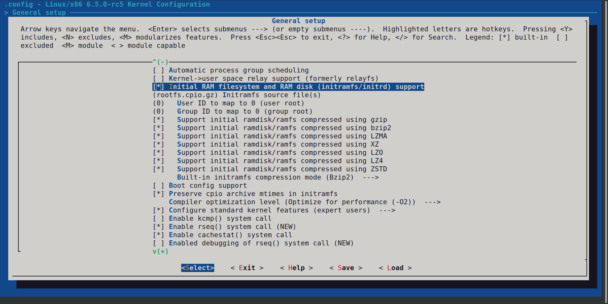
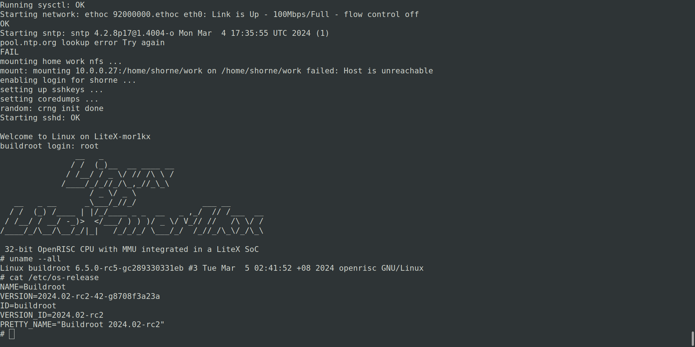

# Building Up a OpenRISC Linux with Buildroot
## Introduction
In this blog post, we'll guide you through setting up a Linux environment for OpenRISC on QEMU. We'll start by establishing a development environment, then move on to building a cross-compiler toolchain, configuring Buildroot, compiling the Linux kernel, and finally setting up QEMU for emulation. This straightforward guide is designed to provide you with the necessary steps to get a Linux system running on the OpenRISC architecture.
## What to Build
- Cross-compiler toolchain (v10.0.0 20190722)
- Buildroot Enviroment (v2024.02-rc2)
- Linux Kernel (v6.5.0-rc5)
- QEMU (v8.2.50)
## Cross-compiler Toolchain
### Building openRISC toolchain
```
mkdir -p ~/openRISC
cd ~/openRISC
git clone https://github.com/stffrdhrn/or1k-toolchain-build.git
docker build -t or1k-toolchain-build or1k-toolchain-build/
```
```
CACHEDIR=$HOME/openRISC/docker/volumes/src
OUTPUTDIR=$HOME/openRISC/docker/volumes/crosstool

docker run -it --rm \
  -e MUSL_ENABLED=1 \
  -e NEWLIB_ENABLED=1 \
  -e NOLIB_ENABLED=1 \
  -e GCC_VERSION=11.0.1 \
  -e BINUTILS_VERSION=2.36.50 \
  -e NEWLIB_VERSION=4.2.0 \
  -e LINUX_HEADERS_VERSION=5.12.2 \
  -e MUSL_VERSION=1.2.2 \
  -e GMP_VERSION=6.2.1 \
  -v ${OUTPUTDIR}:/opt/crosstool:Z \
  -v ${CACHEDIR}:/opt/crossbuild/cache:Z \
  or1k-toolchain-build
```
### Download a Released
Download the release at https://github.com/openrisc/or1k-gcc/releases
```
wget https://github.com/openrisc/or1k-gcc/releases/download/or1k-12.0.1-20220210-20220304/or1k-linux-12.0.1-20220210-20220304.tar.xz
mkdir -p /opt/openRISC/crosstool
tar -xf or1k-linux-12.0.1-20220210-20220304.tar.xz -C /opt/openRISC/crosstool
```
Open shell configuration file: `nano ~/.bashrc`
Add the following line
`export PATH=/opt/openRISC/crosstool/or1k-linux/bin:$PATH `
Apply Changes:
`source ~/.bashrc`
## Buildroot
```
git clone https://github.com/buildroot/buildroot.git
git clone https://github.com/stffrdhrn/or1k-utils.git
cd buildroot
make BR2_EXTERNAL=../or1k-utils/buildroot/ litex_mor1kx_defconfig
make
```
## QEMU
- Install Required Dependencies
  `sudo apt-get install -y git libglib2.0-dev libfdt-dev libpixman-1-dev zlib1g-dev build-essential`
- Clone QEMU Source code
  `git clone https://git.qemu.org/git/qemu.git`
- Configure the Build for or1k
  `./configure --target-list=or1k-softmmu,or1k-linux-user`
- Compile & Install QEMU
    ```
    make
    sudo make install
    ```
## Linux Kernel
Get the linux code
`git clone https://github.com/openrisc/linux`
Setup linux source code
```
cd linux
export ARCH=openrisc
export CROSS_COMPILE=or1k-linux-
```
Use the build-in default configuration
`make defconfig`

Initialize initram
- Copy `rootfs.cpio.gz` from `buildroot/output/images/`
- General Setup -> Initramfs Source
- Set Initramfs source files = `rootfs.cpio.gz` which build in buildroot
- gzip = y
- initramfs mode -> Bzip2

## Run QEMU
```
qemu-system-or1k -cpu or1220 -M or1k-sim -nographic \
      -kernel vmlinux \
      -m 128
```

## Running Linux on QEMU
